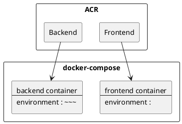

# Docker-compose environment 값 설정

```plantuml

@startuml

rectangle "ACR" {
    rectangle "Frontend" 
    rectangle "Backend"
}

rectangle "docker-compose" {
    rectangle front [
        frontend container
        ---
        environment : 
    ]

    rectangle back [
        backend container
        ---
        environment : ~~~
    ]
}

Frontend --> front
Backend --> back


@enduml

```